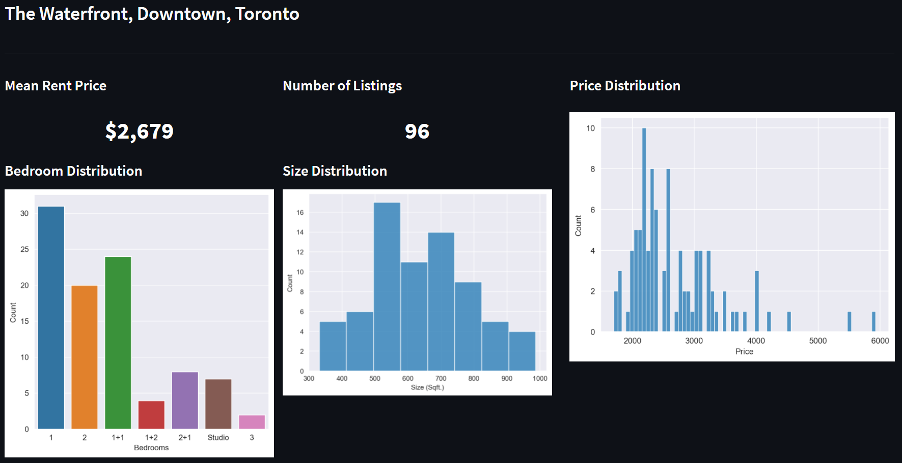

# Basic Analytics Web App using Streamlit

1. ensure requirements.txt is up to date by running 'pip freeze > requirements.txt'

2. **Build Docker Image**
 docker build -t analyticswebapp:latest -f docker/Dockerfile .
3. **check to see if image is present**
   docker image ls
4. **Create the container**
   docker run -p 8501:8501 analyticswebapp:latest

## This repo is responsible for the analytics visualizations

